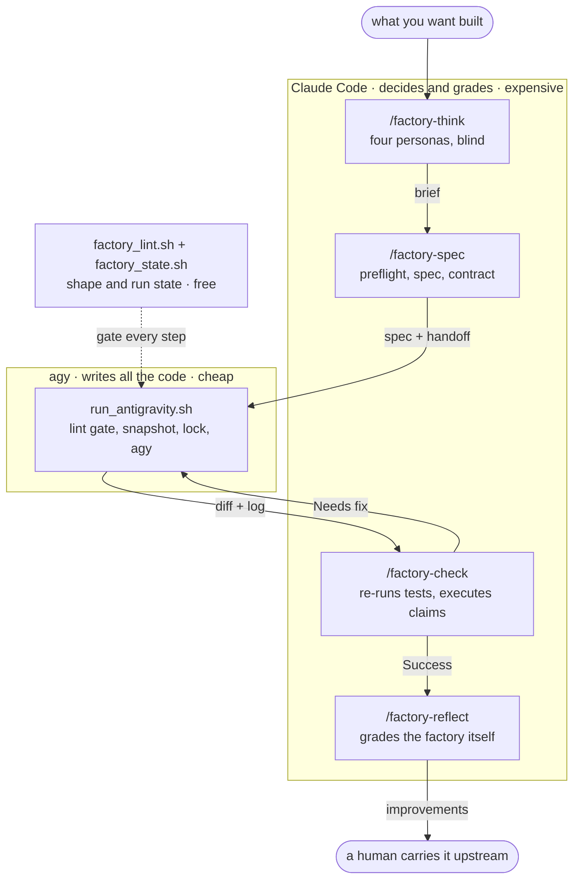
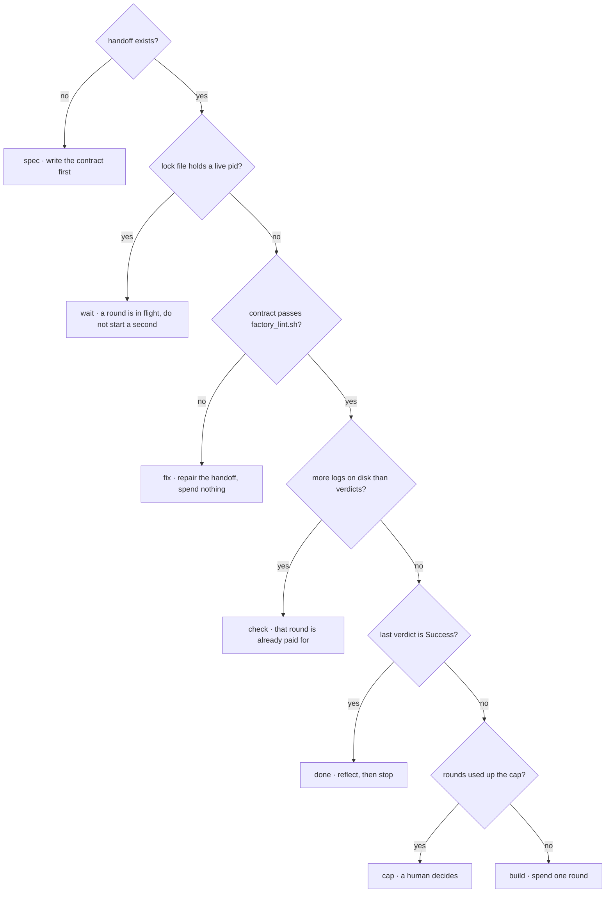

# ai-factory

Small AI factory for one repo. Claude Code writes the spec, the
[Antigravity CLI](https://antigravity.google) (`agy`) writes the code, Claude
Code checks the result.

A few moving parts, no magic:

| Part | Who runs it | What it does |
|---|---|---|
| `/factory-think` | Claude Code | runs four personas in parallel over the code, writes `factory/briefs/<slug>.md` — the WHY |
| `/factory-spec` | Claude Code | reads the brief and the code, writes `specs/<slug>.md` + `handoffs/<ts>-<slug>.md` |
| `/factory-build` | Claude Code | launches `agy`, waits, verifies, re-runs until pass or cap |
| `scripts/run_antigravity.sh` | Claude or your shell | calls `agy` with that contract, tees the log to `handoffs/` |
| `/factory-check` | Claude Code | re-runs the tests, checks the walkthrough against the diff, appends a verdict |
| `/factory-reflect` | Claude Code | after the run ends, writes proposals for improving the factory into `factory/improvements.md` |
| `scripts/factory_lint.sh` | anyone, any time | shape checks on brief, spec, handoff and logs. free, deterministic, no model call |
| `scripts/factory_state.sh` | anyone, any time | where the run stopped and what to do next, read off the files |

Files are the only thing these parts share, which is what lets Claude and `agy`
hand work back and forth without a shared session. The rules they all obey are in
[`PRINCIPLES.md`](PRINCIPLES.md) — one page, worth reading before you change
anything here.

## Who does what, and why

`agy` tokens are cheap. Claude tokens are expensive. Every part of this splits
along that line:

- **Claude Code is a team of senior colleagues.** It decides what is worth
  building, writes the guidelines the work must follow, and grades what comes
  back. It does not type the code — not the feature, not the tests, not the
  scaffolding, not the "it's one line" fix.
- **`agy` is a team of mid-to-senior developers.** Fast, competent, and good at
  following a contract. It gets the whole slice: implementation, tests,
  fixtures, migrations, docs, boilerplate.

So a handoff stays short while the job it asks for can be large — the ~60-line
limit is on the contract, not the work. And when the fix is obvious, it still
goes back as a next-fix bullet, because a senior who takes the keyboard has
stopped grading the work and there is now nobody left who is.

The one thing worth spending expensive tokens on is judgement: the contract going
in, and the verdict coming out.

The same logic runs one level down. Anything a *rule* can decide — a missing
section, a `Difficulty:` line that is not one of three words, a done list with no
checkboxes, a log with no `RESULT:` block — is decided by `factory_lint.sh`,
which is free, identical every time, and never gets bored on the third round. The
skills run it first and spend judgement only on what is left.

## How it fits together

Three lanes, priced differently. Work flows down the middle; the loop is the edge
back from `check` to the builder.



Nothing in the diagram shares a session with anything else. What crosses each
arrow is a file, and that is the whole trick — it is why a dead session, a new
model, or a hand-driven shell can pick up anywhere without being told what
happened before.

```
factory/briefs/<slug>.md      WHY        think writes   ·  everyone reads
specs/<slug>.md               WHAT       spec writes    ·  agy + check read
handoffs/<ts>-<slug>.md       CONTRACT   spec writes    ·  agy reads, check appends
handoffs/logs-<ts>-<slug>.txt EVIDENCE   runner writes  ·  check + reflect read
factory/improvements.md       LESSON     reflect writes ·  a human reads
```

The handoff is the one that grows. Each round appends its verdict, so the file
ends up being the history of the whole attempt:

```
handoffs/20260815T142211Z-api-rate-limit.md
├─ Goal · Files to touch · Tests to run · Done criteria   <- /factory-spec, once
├─ ## Check 20260815T145533Z   Needs fix   41 tests       <- round 1 verdict
├─ ## Check 20260815T151002Z   Needs fix   58 tests       <- round 2 verdict
└─ ## Check 20260815T153340Z   Success     63 tests       <- round 3 verdict
```

## Install into a project

The harness lives in this repo and is pulled into a project as a submodule, so
one copy serves every project you use it in.

```bash
cd /path/to/your-project
git submodule add https://github.com/Mergoth/ai-factory factory-engine
bash factory-engine/install.sh
```

`install.sh` symlinks the harness into the paths Claude Code and `agy` look at,
then creates the working directories:

```
your-project/
  factory-engine/                       # submodule, the harness
  .claude/skills/factory-think    -> factory-engine/skills/factory-think
  .claude/skills/factory-spec     -> factory-engine/skills/factory-spec
  .claude/skills/factory-build    -> factory-engine/skills/factory-build
  .claude/skills/factory-check    -> factory-engine/skills/factory-check
  .claude/skills/factory-reflect  -> factory-engine/skills/factory-reflect
  .agents/skills                  -> factory-engine/agents/skills
  scripts/run_antigravity.sh      -> factory-engine/scripts/run_antigravity.sh
  scripts/factory_lint.sh         -> factory-engine/scripts/factory_lint.sh
  scripts/factory_state.sh        -> factory-engine/scripts/factory_state.sh
  factory.env                     # real file, yours, per project
  factory/                        # YOUR project brain
    context.md                    #   how this repo works
    adr/                          #   binding decisions
    briefs/                       #   why each feature exists
    memory.md                     #   lessons from past runs
    improvements.md               #   proposals to improve the factory itself
    personas/                     #   extra lenses, empty by default
    prompt-extra.md               #   raw orders for the builder
  specs/                          # feature specs
  handoffs/                       # contracts + logs
  .factory-cache/                 # gitignored: model list, locks, snapshots
```

Two directories, and the split is the whole idea:

- **`factory-engine/`** — the machinery. Vendored, replaced wholesale on update.
  Never edit it; your changes would be blown away and belong upstream anyway.
- **`factory/`** — your project's own knowledge. Seeded once, then yours forever.

Symlinks mean improvements to the harness reach every project with
`git submodule update --remote factory-engine`. Nothing is copied, so nothing
drifts.
On a filesystem without symlinks, use `bash factory-engine/install.sh --copy` and
re-run it after each update.

Then set your test command:

```bash
$EDITOR factory.env      # TEST_CMD="pytest -q"  (or npm test, go test ./..., ...)
```

## Teaching it about your project

`factory-engine/` is the vendored harness — never edit it. **`factory/` is yours**,
and it is how one generic harness becomes specific to this codebase. `install.sh`
seeds it; fill in what is useful and skip the rest.

| File | What it is | Who reads it |
|---|---|---|
| `factory/context.md` | stack, commands, layout, conventions, gotchas | all |
| `factory/adr/` | architecture decisions, numbered. **Binding.** | all |
| `factory/memory.md` | one-line lessons from past runs | builder, spec |
| `factory/improvements.md` | proposals for fixing the harness, with evidence | reflect |
| `factory/briefs/` | why each feature was built, what was rejected | all |
| `factory/personas/` | extra lenses for `/factory-think` | think |
| `factory/prompt-extra.md` | raw orders pasted into the builder prompt | builder |

Each has a distinct job, and keeping them apart is what stops the whole thing
turning into one sprawling prompt:

- **`context.md`** — things always true about the repo. Where code lives, how to
  run it, what a good test looks like here.
- **`adr/`** — decisions with consequences. `/factory-check` treats a broken ADR
  as `Needs fix` **even when every test passes**, because tests do not encode
  architecture. `/factory-spec` offers to write one when a change decides
  something structural, and refuses to quietly violate an existing one.
- **`memory.md`** — what went wrong last time. "Flash models keep missing the
  retry decorator in `api/`." `/factory-build` appends a line when a round
  teaches something, and is told to keep it under ~40 lines and delete stale
  entries — a wrong memory costs more than no memory.
- **`improvements.md`** — written by `/factory-reflect` after every full run.
  Where `memory.md` records what this *project* taught, this records what the
  *factory* got wrong: a check that missed a defect class, a round Claude spent
  typing code `agy` should have written, a default nobody edited. Each entry
  names a real engine file and quotes the wording it proposes. It is a queue, not
  a changelog — `factory-engine/` is never edited from a project, so carrying an
  entry upstream is a human action.
- **`briefs/`** — written by `/factory-think`, one per feature. The only file
  that answers "why is it like this" six months later, and the only one holding
  the alternatives you rejected, so nobody re-proposes them.
- **`personas/`** — drop a markdown file here and it joins the `/factory-think`
  round table on the next run. No re-install, nothing to register; a file whose
  name matches a built-in replaces it. Add `security.md` or `data.md` when the
  default four keep missing a concern this project actually has. See
  [`personas/README.md`](personas/README.md).
- **`prompt-extra.md`** — the escape hatch, when you want to tell the builder
  something directly without forking the harness.

Files still holding their seeded `factory:template` marker **on line 1** are
treated as unfilled and **not** sent to `agy` — blank headings would read as
project facts. Delete the marker line when you fill one in; the runner prints a
loud warning naming each file it dropped, because a missing `context.md` is
invisible until you read a log and notice the builder re-deciding every
convention. Only line 1 counts, so a filled-in file that mentions the marker in
its own gotchas section no longer drops itself.

Nothing here is required; an empty `factory/` just means the builder works from
the spec alone.

## Use it

**1. Think.** In Claude Code:

```
/factory-think add rate limiting to the public API
```

Four personas — **product, architect, skeptic, operator** — read the codebase in
parallel, blind to each other, each as a read-only subagent so none of them can
touch code. Then Claude reconciles them and writes:

```
factory/briefs/api-rate-limit.md
```

The brief holds what the spec cannot: why this is worth building, what "done"
looks like from outside, which alternatives were rejected and why, and every
assumption taken where the request was ambiguous.

Blind and parallel is the whole trick. Run in sequence they read each other and
converge on whatever the first one said; run blind they disagree, and the
disagreements are the findings. Consensus that arrives instantly usually means
four agents read the same README.

They will not interrogate you. Personas cannot ask anything at all; only the
synthesis step can, capped at **three questions, asked once, together**, and only
where two readings genuinely produce different code. Everything else becomes a
line under Assumptions, which you can veto at a glance.

Skip this step for a rename or a typo — four subagents to decide on a rename is
theatre, and the skill will tell you so itself.

**2. Spec.** Chains automatically from the brief, or run it alone:

```
/factory-spec add rate limiting to the public API
```

Claude reads the brief and the code and writes two files:

```
specs/api-rate-limit.md
handoffs/20260815T142211Z-api-rate-limit.md
```

Read the handoff before running anything. It has Goal, Files to touch, Tests to
run, Done criteria, and any environment limits — things in scope that cannot be
verified on this machine, so the builder declares them uncovered instead of
claiming success. If it is wrong, say so and Claude rewrites it — that is far
cheaper than letting `agy` build the wrong thing.

`/factory-spec` refuses to write a handoff when the harness would waste the round
anyway: `TEST_CMD` that does not start, a repo with no commits (nothing for the
walkthrough-versus-diff check to compare against, and `git clean -fd` as the only
rollback verb), or a greenfield repo with no scaffolding — that last one gets its
own cheap `mechanical` handoff whose only criterion is that `TEST_CMD` runs green,
rather than making round 1 invent a package layout and a feature at once. The
runner re-checks `TEST_CMD` before every call to `agy`, since `command not found`
otherwise costs a full paid round to discover.

**3. Build.** In Claude Code:

```
/factory-build api-rate-limit
```

Claude prints the handoff's goal and done criteria, launches `agy` in the
background, waits for it to exit, verifies the result, and re-runs `agy` with
the fix bullets until the tests pass or `MAX_ROUNDS` (default 3) is hit. You do
not have to sit in the terminal for it.

The run has to be backgrounded because Claude Code caps foreground shell
commands at 10 minutes and an `agy` run can be longer. `/factory-build` handles
that; it is only worth knowing if you rewrite the skill.

If you would rather drive it by hand, the script is a normal script:

```bash
bash scripts/run_antigravity.sh api-rate-limit
```

This calls `agy --print` with a prompt pointing at the spec and handoff, and
saves everything to `handoffs/logs-<ts>-api-rate-limit.txt`. Add `--dry-run` to
see the exact prompt and command without calling `agy`.

`agy` changes code and runs tests. It does not commit, branch, or push — the
diff is left in your working tree for you to review.

### The walkthrough

`agy` does not just report pass/fail. Its report ends with a walkthrough:

```
WALKTHROUGH:
  how it works    - the flow after the change, in order, naming real functions
  why             - each choice a reviewer would question, and the reason
  verify by hand  - exact commands to watch it work, not the test suite
  not covered     - what it did not test, and what it is unsure about
```

This is not decoration. `/factory-check` reads it **against `git diff`**, which
catches a failure class the tests cannot: a walkthrough describing code that was
never written. That is `Needs fix` regardless of a green suite, as is a "why"
that contradicts an ADR or re-proposes something the brief already rejected.

The other half is for you. After an unattended loop, "verify by hand" is the one
thing worth having — a command that shows you the feature working, rather than a
test suite asserting that it does.

### Model selection

**No model ids are configured anywhere.** They rotate — a whole new family
appeared while this README was being written — so a pinned id rots silently and
costs you a failed round to discover.

- **The spec says how hard, not which model.** `/factory-spec` writes a
  `Difficulty:` line (`mechanical` / `normal` / `tricky`) into the handoff.
- **The build agent picks.** `/factory-build` runs `agy models`, reads today's
  real list, maps difficulty to a family and tier, and passes `--model`.
  Cheap flash for a rename, the strongest thinking model for tricky logic. It
  steps up a tier when a round fails on correctness rather than re-rolling the
  same model against the same contract.
- **The script validates and falls back.** The chosen id is checked against the
  live list, so a dead id is caught without burning a call. If `agy` itself
  fails to run, the script tries other models — **preferring a different
  family**, since three tiers of one family all die together when that family
  is down.

The fallback triggers on `agy` exiting non-zero — a bad id, quota, transport
failure. It deliberately does **not** trigger when `agy` runs fine but the build
fails, because that is the builder's problem, not the model's, and retrying it
on three models would just cost three times as much to fail the same way.

The list is cached in `.factory-cache/` (gitignored) for `MODELS_TTL_MIN`
minutes, since the fetch is a slow network call and every round would otherwise
pay it. Force a refresh with `--refresh-models`.

```bash
bash scripts/run_antigravity.sh api-rate-limit --model <id from agy models>
```

Two more things about `agy` the runner works around, worth knowing if you edit
the prompt:

- **It does not inherit your shell's cwd.** In `--print` mode its terminal
  starts in `~/.gemini/antigravity-cli/scratch`. The runner passes `--add-dir`,
  writes every path in the prompt as absolute, and tells `agy` to prefix each
  command with `cd <repo root>`. Drop that and it will hunt across your whole
  filesystem for `specs/` and report the spec as missing.
- **Its exit code is 0 even when the build fails.** A blocked run and a clean
  run both exit 0, so the exit code is not a signal. The report in the log and
  the actual test run are what count — which is why `/factory-check` re-runs
  the tests itself.

**4. Check.** Back in Claude Code:

```
/factory-check api-rate-limit
```

Claude reads the brief, the spec, the handoff, the log and `git diff`, **re-runs
the tests itself** rather than trusting the log, checks the walkthrough against
the diff, and appends a block to the handoff:

```markdown
## Check 20260815T145533Z

Status: Needs fix
Tests: 2 failed, 41 passed
Walkthrough: matches diff

- [x] limiter rejects over 100 req/min
- [ ] 429 response includes Retry-After header
- red flag: test_burst_allowance was marked skip, not fixed

### Next fix
- set Retry-After on the 429 path in api/middleware.py
- un-skip test_burst_allowance and make it pass
```

With a brief present it also asks the harder question: is "What done looks like"
actually true now? Code that ticks every checkbox while missing the point is the
expensive failure, and the checkbox list is exactly where it hides.

Three checks are worth knowing about, because each of them was bought with a
defect that shipped past a green test suite:

- **Behavioural criteria get executed, not read.** "X is rejected" is not checked
  until the input that violates it has been constructed and run. A grep proves a
  string is absent; it does not prove a behaviour holds. Side-effect attacks are
  judged by the side effect, since a successful one usually returns something
  empty and innocuous.
- **The test count has to move.** A green suite that did not grow, when the
  handoff asked for new tests, is the signature of a truncated run — which is
  otherwise indistinguishable from a clean one, exit code and all. A log with no
  `RESULT:` and no `WALKTHROUGH:` is `Needs fix` whatever the tests say.
- **Durable artefacts get opened.** Tests assert what their author thought to
  assert, and routinely cover behaviour while missing shape. If the change writes
  a log line or a record, one real instance lands in the status block verbatim.

**5. Reflect.** When the run ends — passed or capped:

```
/factory-reflect api-rate-limit
```

`/factory-build` does this automatically as its last step. It reads every status
block and every round's log, reconstructs what each round cost, and appends
proposals to `factory/improvements.md`: what got past a green suite, what cost a
round, what Claude typed that `agy` should have written, and what worked and must
not be refactored away. Every entry names a real engine file and cites the round
it came from — no evidence from the run, no entry, capped at five.

Nothing in the harness changes on its own. The file is a queue for a human to
carry upstream.

**6. Loop.** `/factory-build` already loops, so normally there is nothing to do
here. If you are driving by hand, `Needs fix` means run step 3 again — the
next-fix bullets are in the handoff, so `agy` picks them up on the same
contract. Repeat until `Status: Success`.

To watch a long-running job instead of driving it, use Claude Code's built-in
`/loop`:

```
/loop 5m /factory-check api-rate-limit
```

That re-runs the check every five minutes. `/factory-check` prints `DONE` when
the status is Success, which is your signal to stop the loop.

### Which one to use

- `/factory-think` — when you are not yet sure what should be built, or the
  request is vague enough that two people would build different things.
- `/factory-spec` straight away — when you already know exactly what you want and
  the brief would just be ceremony.
- `/factory-build` — the normal path once a handoff exists. Hands-off until it
  passes or gives up.
- `run_antigravity.sh` + `/factory-check` — when you want to inspect the diff
  between every round, or you are debugging the harness itself.
- `/factory-reflect` — after any run that ended, if you drove it by hand.
  `/factory-build` runs it for you. A capped run is the one most worth
  reflecting on, not the one to skip.
- `/loop /factory-check` — when something else is running the builds and you
  only want to poll the verdict.
- `scripts/factory_state.sh` — any time you have lost the thread. Also the first
  thing `/factory-build` runs.

## When something dies

Sessions run out of context. `agy` times out. Networks drop, laptops sleep,
people hit ctrl-c. The factory assumes every step dies at its worst moment, so
**no run state lives in an agent's head**:

| What you want to know | Where it actually lives |
|---|---|
| how many rounds this slug has cost | the number of `handoffs/logs-*-<slug>.txt` files |
| what the last round did | that log's header, report and `WALKTHROUGH:` |
| whether anyone judged it | the `## Check` blocks appended to the handoff |
| whether a round is running right now | `.factory-cache/locks/<slug>.lock`, with a live pid in it |
| what the tree looked like before this round | `.factory-cache/snapshots/<ts>-<slug>.tar.gz` |

So picking a run back up is one command, from a session that knows nothing:

```bash
bash scripts/factory_state.sh api-rate-limit
```

```
rounds_run:   2 (max 3)
rounds_check: 1
running:      no - stale lock from pid 41233 started 20260816T1902Z; that round died
log_state:    killed mid-round (no exit footer)
last_status:  Needs fix
snapshot:     .factory-cache/snapshots/20260816T1902Z-api-rate-limit.tar.gz
restore:      tar xzf .factory-cache/snapshots/20260816T1902Z-api-rate-limit.tar.gz -C /repo
next:         check
resume:       /factory-check api-rate-limit
```

`next:` is one of `spec`, `fix`, `wait`, `build`, `check`, `cap`, `done`, and
`/factory-build` obeys it rather than its own memory. It is decided by looking at
files, in this order:



Three of those matter most:

- **`wait`** — a round is genuinely in flight. The runner takes a lock and
  refuses to start a second one, because two `agy` processes editing one tree is
  how a good round gets eaten by a bad one, and afterwards nobody can tell which
  write came from where.
- **`check`** — a round ran and nobody judged it. It is already paid for;
  re-running it would buy the same thing twice.
- **`cap`** — the round counter comes off the disk, so a resumed session counts
  the same cap the dead one was counting, instead of starting again from zero and
  spending it twice.

**Work is not lost when a round dies.** Whatever `agy` wrote stays in the working
tree. And before each round the runner tars every uncommitted file — modified
*and* untracked, ignored files excluded — into `.factory-cache/snapshots/`. That
is the undo button for the other failure: a round that makes things *worse*. The
`restore:` line above is the exact command, and the last ten snapshots per slug
are kept.

`.factory-cache/` holds the model list, the locks and those snapshots. It is
gitignored, and safe to delete when nothing is running.

## Safety

- **Network:** the only outbound call is `agy` itself. Nothing else phones home.
- **Side effects stay in the repo:** `run_antigravity.sh` `cd`s to the repo root
  and runs `agy` there. `agy` is told not to commit, push, or branch.
- **`--dangerously-skip-permissions`** is passed to `agy` on purpose — `--print`
  is non-interactive, so a permission prompt would hang forever with nobody to
  answer it. This is the real trade: `agy` gets unattended tool access inside
  the repo. Use `--dry-run` first on a new project, and review the diff before
  committing anything.
- **Separation of duties:** `agy` never edits `specs/` or `handoffs/`;
  `/factory-check` and `/factory-build` never edit code. Nothing grades its own
  work.
- **The factory does not modify itself.** `/factory-reflect` proposes changes to
  the harness in a project file and stops there. `factory-engine/` is vendored
  and edited only upstream, by a human, in a diff they read.
- **Personas are read-only by construction.** They run as `Explore` subagents,
  which have no write tools — a thinking step cannot quietly become a building
  step, and that is enforced by the harness rather than by asking nicely.
- **Bounded loop:** `/factory-build` stops at `MAX_ROUNDS` (default 3), and
  earlier if two rounds produce the same failure. It will not spend your money
  in a circle, and it asks before raising its own cap. The counter is the number
  of logs on disk, so a resumed session cannot quietly restart the budget.
- **One round at a time:** a lock file with a live pid stops a second `agy` run
  starting on the same slug, whichever session launches it.
- **Undo before each round:** every uncommitted file is snapshotted to
  `.factory-cache/snapshots/` before `agy` is called, so a bad round can be
  rolled back without touching git history.
- **No secrets:** `factory.env` holds a test command, a round cap, and timeouts.
  Keep credentials out of it — it is committed to your project repo.
- **Logs are gitignored** (`handoffs/logs-*.txt`) since they can be long and may
  echo local paths. The handoff and its status blocks are committed; those are
  the record worth keeping.

## Changing the harness

The harness has its own test suite, and it needs no `agy`, no network and no
money:

```bash
bash scripts/selftest.sh          # ~12 seconds, 70 cases
bash scripts/selftest.sh --only lock
bash scripts/selftest.sh --keep   # leave the sandbox repos to poke at
```

It builds throwaway git repos under `$TMPDIR`, installs this harness into them,
puts a **fake `agy`** on `PATH` — one that can succeed, fail on a given model,
or die mid-sentence — and drives the real scripts against them. It covers
install and re-install, the runner's preflight gates, the template-marker rule,
locks and stale locks, snapshot capture and restore, the round counter, model
fallback, every lint rule, and all seven states of the resume machine.

Two rules keep it useful:

- **A bug in the harness arrives here as a failing case before it is fixed.**
  Both bugs found while writing these scripts — a `pipefail` + empty-glob exit
  that silently killed the linter, and two rounds in one second sharing a log
  filename so a round vanished from the counter — are cases in this file now.
- **It touches nothing outside its sandbox.** If a case ever needs your real
  repo, the case is wrong.

The prose is a different matter. `SKILL.md` files are instructions *for a model*,
and no script can tell you whether the wording lands. What it can tell you is
that the machinery underneath still behaves.

## Requirements

- `agy` on `PATH` — [Antigravity CLI](https://antigravity.google)
- `git`, `bash`, `awk`
- Claude Code, for the four skills

## Layout of this repo

```
PRINCIPLES.md                  # the rules every skill obeys
install.sh                     # symlink harness into a target repo
skills/factory-think/SKILL.md  # Claude: run personas, write brief
skills/factory-spec/SKILL.md   # Claude: write spec + handoff
skills/factory-build/SKILL.md  # Claude: drive agy, loop, verify
skills/factory-check/SKILL.md  # Claude: verify, write status
skills/factory-reflect/SKILL.md # Claude: post-mortem the run, propose fixes
personas/product.md            # lens: who hurts, what done looks like
personas/architect.md          # lens: where it lands, what it couples to
personas/skeptic.md            # lens: what it assumes, where it breaks
personas/operator.md           # lens: test, fail loudly, roll back
scripts/run_antigravity.sh     # call agy, tee log, lock, snapshot
scripts/factory_lint.sh        # shape checks, free, no model call
scripts/factory_state.sh       # where the run stopped, what to do next
scripts/selftest.sh            # the harness's own test suite, no agy needed
agents/skills/                 # agy-side skills (empty by design)
templates/brief.md             # shape of a brief
templates/spec.md              # shape of a spec
templates/handoff.md           # shape of a handoff
templates/context.md           # seeds factory/context.md
templates/memory.md            # seeds factory/memory.md
templates/improvements.md      # seeds factory/improvements.md
templates/adr.md               # shape of an ADR
templates/prompt-extra.md      # seeds factory/prompt-extra.md
factory.env.example            # per-project config template, no model ids
```

## License

MIT
